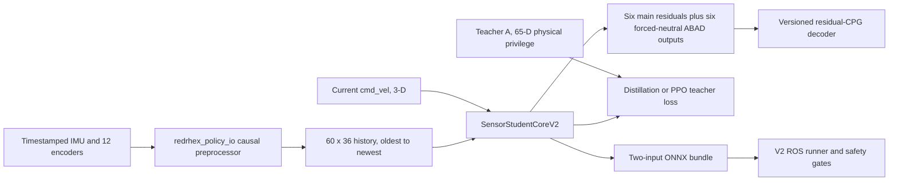

## Problem

The legacy student relies on simulator-only velocity and controller state and its deployment path substitutes unavailable measurements. RedRHex needs a reversible research route that learns temporal state from measurable feedback without redefining any V1 task, checkpoint, export, ROS configuration, or standard Panel training behavior.

## Goals and non-goals

- Goal: train a forward residual policy from one second of causal physical feedback plus the current external command.
- Goal: preserve a physically privileged teacher and critic while proving that privileged fields never enter the deployed actor.
- Goal: bind observation, action, calibration, architecture, checkpoint, and export semantics with hashes and strict transitions.
- Goal: make simulation, replay, ONNX, and ROS use the same versioned preprocessing contract.
- Non-goal: migrate or reinterpret V1 artifacts.
- Non-goal: enable learned ABAD, direct joint targets, contact supervision, or automatic motor enable.
- Non-goal: claim sim-to-real success without reviewed recorded or physical evidence.

## Architecture

V1 and V2 are selected by different task, runner, checkpoint-kind, contract ID, ONNX metadata, and ROS YAML. No dimension-based guessing crosses that boundary.

## Observation contract

`StudentObservationContractV2` is immutable canonical JSON with SHA-256. It records slices, units, source, actor permission, normalization ownership, sample rate, timestamp rules, filters, mount transform, attitude mode, history order, warm-up, and reset behavior.

| Slice | Input | Dim | Actor rule |
|---|---|---:|---|
| `0:3` | Body gyro | 3 | Calibrated IMU in policy body frame |
| `3:6` | Projected gravity | 3 | Explicit validated quaternion or causal gyro/accelerometer estimator |
| `6:12` | Main position sine | 6 | Measured continuous encoders |
| `12:18` | Main position cosine | 6 | Measured continuous encoders |
| `18:24` | Main velocity | 6 | Validated velocity or wrapped causal finite difference |
| `24:30` | ABAD position | 6 | Measured neutral-relative calibrated position |
| `30:36` | ABAD velocity | 6 | Measured causal finite difference |

History is fixed at 60 samples and 60 Hz, ordered oldest to newest. `command_v2` is a separate current `[vx, vy, wz]` vector. Linear acceleration may correct attitude but is not an actor feature. Base velocity, gait phase, last action, odometry, command feedback, controller targets, and privilege are prohibited actor inputs.

`validated_quaternion` fails unless covariance, norm, frame, mount, and rest-gravity evidence pass. `causal_gyro_accel` has no magnetometer and no fallback. Selecting either mode changes the contract hash and requires a matching trained bundle.

## Action contract

`ForwardResidualActionContractV2` hashes leg order, tripods, signs, CPG frequency and duty cycle, phase offsets, policy rate, residual scales, clamps, and joint semantics. Outputs `0:6` are normalized main-drive residuals around the nominal forward CPG. Outputs `6:12` are forced to zero before rollout, loss, export, and deployment in strict F0–F5. The actor never receives the CPG phase.

ROS loads decoder semantics from the bundle. Hardware safety limits may tighten them but cannot reinterpret them. Learned ABAD or direct targets require a new action-contract version and design.

## Training interfaces

The actor uses `sensor_history_v2` and `command_v2`. `CausalTCNEncoderV2` has four single-convolution residual blocks, kernel 5, dilations 1/2/4/8, width 64, exact 61-frame receptive field, and a 64-D latest-step latent. A featurewise normalizer is checkpointed and exported with the actor. Heads produce 12 actions, 3-D base-velocity estimate, and 36-D next-frame estimate; contact is absent.

Teacher A is 65-D: current sensor-equivalent state, command, true base velocity, base height, main and ABAD strength, fault mask, mass, friction, terrain, and disturbance. Teacher B adds twelve internal controller targets and is a named research-only ablation that cannot enter production provenance. The PPO critic uses the physical group and excludes controller targets.

Distillation stores teacher, student, and executed actions plus next-frame targets. It executes clipped `beta * teacher + (1 - beta) * student + noise`; beta and noise fall to zero over the first 70 percent and the final 30 percent is deterministic student rollout. Default loss weights are main Huber 1.0, ABAD 0.0, velocity Huber 0.5, dynamics Huber 0.1, latent regularization `1e-4`, and contact 0. Dynamics is masked across termination and reset.

PPO bootstraps the actor and normalizer by strict equality, creates a fresh critic and optimizer, and adds teacher BC 0.2 to zero over the first 60 percent plus persistent auxiliary losses. Standard rollout, GAE, clipping, and minibatching remain upstream-compatible.

## Artifact contract

An allowlisted factory is the only V2 runner construction path. V2 requires RSL-RL `>=3.1.2,<3.2`. CLI transitions are explicit: `--teacher_checkpoint` starts distillation, `--student_checkpoint` starts PPO, and `--resume --checkpoint` resumes the exact same kind. These modes are mutually exclusive and never use shape-compatible partial loading.

The core CLI exposes the same allowlisted transitions as individual F1/F2/F3 routes and as one sequential full pipeline. The full route starts F2 only after F1 exits successfully and produces a strict Teacher A checkpoint, then starts F3 only after F2 produces a strict distilled checkpoint. The recovered browser route is intentionally isolated on the stacked Panel physics/calibration proposal branch because both features edit the same Panel surfaces; it must preserve these checks when reviewed. Sensor V2 launch must not consume the mutable V1 Panel reward/terrain override files.

Checkpoint kinds are `teacher_v2`, `student_distilled_v2`, and `student_ppo_v2`. Manifests bind contract/action/calibration and architecture/config hashes, dimensions, action order, stage, tool versions, scheduler state, optimizer/model state, and source-checkpoint provenance. Legal edges are teacher to new distillation, distilled to distillation resume or PPO bootstrap, and PPO to PPO resume.

The deployment graph has named inputs `sensor_history [1,60,36]` and `command [1,3]`, and named outputs `actions [1,12]` and `base_velocity_estimate [1,3]`. Normalization is inside the graph. Embedded metadata and an identical JSON sidecar bind every relevant hash; ROS rejects absence, disagreement, names or shapes that differ, and contract mismatch.

## Deployment safety

The V2 bridge publishes all twelve measured joints in canonical order with calibrated positions, causal velocities, per-channel acquisition timestamps, validity, and freshness. V2 never substitutes commanded ABAD, odometry, fake velocity, clock, prior action, or zero padding. INIT_STAND/WARMUP collects 60 valid frames; readiness is impossible before then. Missing, stale, repeated beyond policy, non-finite, or out-of-order data resets history, drops enable latches, and uses the existing protective-stop path.

Startup remains disabled. Contract, action decoder, calibration, IMU frame/mode/rest gravity, twelve encoder signs and zeros, and ABAD counts-per-radian are blocking preflight gates. Automated validation never enables motors.

## Failure modes

Contract or sidecar mismatch is a hard load failure. Unknown calibration ranges stay disabled and unverified. Invalid attitude evidence cannot switch modes. Missing encoder channels cannot be cached as valid. Reset boundaries cannot train the dynamics head. Teacher B provenance cannot be relabeled as Teacher A. Contact output cannot appear without a new validated label contract. Any failed F0 mapping or physics gate blocks RL rather than being compensated by rewards.

## Migration and rollback

The core change is additive: new package, Gym ID, runner names, log roots, checkpoint kinds, exporter, replay command, ROS YAML, and contract-routed builder. The stacked Panel proposal adds the browser route selector separately. No V1 artifact is rewritten. Rollback selects a legacy Gym task, legacy runner, and legacy ROS YAML; once the browser route is reviewed, its rollback selects the standard Panel route. V2 changes can be reverted from F5 back to F0 without changing V1 checkpoint semantics.

## Acceptance

- [ ] Pure contract, preprocessing, history, model, loss, checkpoint, and V1 preservation tests pass.
- [ ] Zero-residual F0 passes existing forward command-sweep thresholds and decoder trace parity.
- [ ] Three Teacher A, distilled, and PPO seeds pass the same forward acceptance protocol.
- [ ] Torch/NumPy, Torch/ONNX, simulator/shared-builder, and synthetic ROS parity pass at `rtol=atol=1e-4`.
- [ ] Recorded replay contains valid provenance, all twelve encoders, a selected IMU mode, no NaN, and no unexplained saturation.
- [ ] Promotion evidence reports all required ablations and teacher gaps without privileged leakage.

## Documentation impact

This feature changes research, architecture, policy-contract, training-command, deployment, calibration, test-status, and troubleshooting knowledge. Its bilingual audit, design, active plan, and shared policy contract are updated together. Panel operation and its operator guide travel with the separate stacked proposal. Evidence summaries are updated only as their corresponding gates become true; the one-update Isaac gate does not imply full-run, three-seed, replay, or hardware acceptance.

## Resolution

Approved as an additive research design on 2026-08-13 and amended the same day to include fail-closed Panel launch/monitoring. Approval authorizes implementation and training, not promotion. Hardware readiness remains blocked by unreviewed IMU behavior and provisional ABAD calibration; deterministic forward, full-run, and multi-seed evidence remain pending until produced by the named gates.
