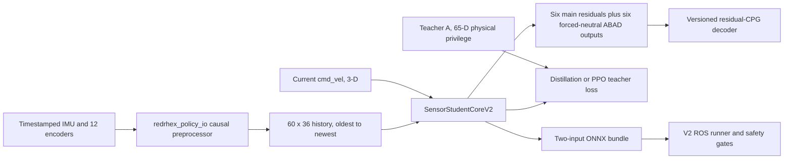

## 問題

Legacy student 依賴 simulator-only velocity 與 controller state，而 deployment path 會替換拿不到的 measurements。RedRHex 需要可回復的 research route，從可量測 feedback 學習 temporal state，且不重新定義任何 V1 task、checkpoint、export、ROS configuration 或 standard Panel training behavior。

## 目標與非目標

- 目標：使用一秒 causal physical feedback 加 current external command 訓練 forward residual policy。
- 目標：保留 physically privileged teacher 與 critic，同時證明 privileged fields 絕不進入 deployed actor。
- 目標：以 hash 與 strict transition 綁定 observation、action、calibration、architecture、checkpoint 與 export semantics。
- 目標：讓 simulation、replay、ONNX 與 ROS 使用相同 versioned preprocessing contract。
- 非目標：遷移或重新解讀 V1 artifacts。
- 非目標：啟用 learned ABAD、direct joint targets、contact supervision 或 automatic motor enable。
- 非目標：沒有經審查的 recorded 或 physical evidence 時宣稱 sim-to-real success。

## 架構

V1 與 V2 分別由不同 task、runner、checkpoint-kind、contract ID、ONNX metadata 與 ROS YAML 選取。此邊界不以 dimension 猜測。

## Observation contract

`StudentObservationContractV2` 是 immutable canonical JSON，並帶有 SHA-256。它記錄 slices、units、source、actor permission、normalization ownership、sample rate、timestamp rules、filters、mount transform、attitude mode、history order、warm-up 與 reset behavior。

| Slice | Input | Dim | Actor rule |
|---|---|---:|---|
| `0:3` | Body gyro | 3 | Policy body frame 中已校正的 IMU |
| `3:6` | Projected gravity | 3 | 明確選擇 validated quaternion 或 causal gyro/accelerometer estimator |
| `6:12` | Main position sine | 6 | Measured continuous encoders |
| `12:18` | Main position cosine | 6 | Measured continuous encoders |
| `18:24` | Main velocity | 6 | Validated velocity 或 wrapped causal finite difference |
| `24:30` | ABAD position | 6 | Measured neutral-relative calibrated position |
| `30:36` | ABAD velocity | 6 | Measured causal finite difference |

History 固定為 60 samples、60 Hz，順序 oldest to newest。`command_v2` 是獨立的 current `[vx, vy, wz]` vector。Linear acceleration 可以修正 attitude，但不是 actor feature。Base velocity、gait phase、last action、odometry、command feedback、controller targets 與 privilege 都禁止成為 actor inputs。

`validated_quaternion` 在 covariance、norm、frame、mount 與 rest-gravity evidence 未通過時必須失敗。`causal_gyro_accel` 沒有 magnetometer，也沒有 fallback。任一模式的選擇都會改變 contract hash，並要求相符的 trained bundle。

## Action contract

`ForwardResidualActionContractV2` hash 綁定 leg order、tripods、signs、CPG frequency 與 duty cycle、phase offsets、policy rate、residual scales、clamps 與 joint semantics。Outputs `0:6` 是 nominal forward CPG 周圍的 normalized main-drive residuals。Strict F0–F5 的 outputs `6:12` 在 rollout、loss、export 與 deployment 前都強制為零。Actor 永遠看不到 CPG phase。

ROS 從 bundle 載入 decoder semantics。Hardware safety limits 可以收緊限制，但不可重新解讀。Learned ABAD 或 direct targets 需要新的 action-contract version 與 design。

## Training interfaces

Actor 使用 `sensor_history_v2` 與 `command_v2`。`CausalTCNEncoderV2` 有四個 single-convolution residual blocks，kernel 5、dilations 1/2/4/8、width 64、精確 61-frame receptive field 與 64-D latest-step latent。Featurewise normalizer 與 actor 一起 checkpoint 及 export。Heads 產生 12 actions、3-D base-velocity estimate 與 36-D next-frame estimate；沒有 contact。

Teacher A 為 65-D：current sensor-equivalent state、command、true base velocity、base height、main 與 ABAD strength、fault mask、mass、friction、terrain 與 disturbance。Teacher B 加入十二個 internal controller targets，是具名的 research-only ablation，不得進入 production provenance。PPO critic 使用 physical group，並排除 controller targets。

Distillation 儲存 teacher、student 與 executed actions，加上 next-frame targets。它執行 clipped `beta * teacher + (1 - beta) * student + noise`；beta 與 noise 在前 70 percent 降到零，最後 30 percent 是 deterministic student rollout。Default loss weights 為 main Huber 1.0、ABAD 0.0、velocity Huber 0.5、dynamics Huber 0.1、latent regularization `1e-4`、contact 0。Dynamics 在 termination 與 reset 邊界 mask。

PPO 以 strict equality bootstrap actor 與 normalizer，建立全新 critic 與 optimizer，並加入前 60 percent 從 0.2 降至零的 teacher BC，加上持續 auxiliary losses。Standard rollout、GAE、clipping 與 minibatching 維持 upstream-compatible。

## Artifact contract

Allowlisted factory 是唯一 V2 runner construction path。V2 要求 RSL-RL `>=3.1.2,<3.2`。CLI transition 明確區分：`--teacher_checkpoint` 開始 distillation、`--student_checkpoint` 開始 PPO，而 `--resume --checkpoint` 只恢復完全相同 kind。這些 modes 互斥，也絕不使用 shape-compatible partial loading。

Core CLI 以 individual F1/F2/F3 routes 與單一 sequential full pipeline 暴露相同 allowlisted transitions。Full route 只有在 F1 成功結束並產生 strict Teacher A checkpoint 後才啟動 F2；也只有在 F2 產生 strict distilled checkpoint 後才啟動 F3。因兩項功能修改相同 Panel 介面，復原出的 browser route 被刻意隔離在堆疊的 Panel physics/calibration proposal branch；審查時必須保留這些檢查。Sensor V2 launch 不得讀取可變的 V1 Panel reward/terrain override files。

Checkpoint kinds 為 `teacher_v2`、`student_distilled_v2` 與 `student_ppo_v2`。Manifests 綁定 contract/action/calibration 與 architecture/config hashes、dimensions、action order、stage、tool versions、scheduler state、optimizer/model state 與 source-checkpoint provenance。合法 edges 只有 teacher 到新 distillation、distilled 到 distillation resume 或 PPO bootstrap，以及 PPO 到 PPO resume。

Deployment graph 具有 named inputs `sensor_history [1,60,36]` 與 `command [1,3]`，以及 named outputs `actions [1,12]` 與 `base_velocity_estimate [1,3]`。Normalization 在 graph 內。Embedded metadata 與相同 JSON sidecar 綁定所有相關 hash；ROS 會拒絕缺項、不一致、不同 names/shapes 與 contract mismatch。

## Deployment safety

V2 bridge 以 canonical order 發布十二個 measured joints，包含 calibrated positions、causal velocities、per-channel acquisition timestamps、validity 與 freshness。V2 不得替換 commanded ABAD、odometry、fake velocity、clock、prior action 或 zero padding。INIT_STAND/WARMUP 收集 60 個 valid frames；之前不可能 ready。Missing、stale、超過 policy 容許的 repeated、non-finite 或 out-of-order data 會 reset history、清除 enable latches，並走既有 protective-stop path。

Startup 維持 disabled。Contract、action decoder、calibration、IMU frame/mode/rest gravity、十二個 encoder signs 與 zeros，以及 ABAD counts-per-radian 都是 blocking preflight gates。Automated validation 永不 enable motors。

## Failure modes

Contract 或 sidecar mismatch 是 hard load failure。Unknown calibration ranges 維持 disabled 與 unverified。Invalid attitude evidence 不能切換 modes。Missing encoder channels 不得 cache 為 valid。Reset boundaries 不得訓練 dynamics head。Teacher B provenance 不得重新標示為 Teacher A。沒有新 validated label contract 就不能出現 contact output。任何 F0 mapping 或 physics gate failure 都會阻擋 RL，不得以 rewards 補償。

## Migration and rollback

Core 變更完全 additive：新增 package、Gym ID、runner names、log roots、checkpoint kinds、exporter、replay command、ROS YAML 與 contract-routed builder。堆疊的 Panel proposal 會另外新增 browser route selector。不重寫任何 V1 artifact。Rollback 可選 legacy Gym task、legacy runner 與 legacy ROS YAML；browser route 通過審查後，其 rollback 則選 standard Panel route。V2 changes 可由 F5 反向回復到 F0，而不改變 V1 checkpoint semantics。

## 驗收

- [ ] Pure contract、preprocessing、history、model、loss、checkpoint 與 V1 preservation tests 通過。
- [ ] Zero-residual F0 通過既有 forward command-sweep thresholds 與 decoder trace parity。
- [ ] 各三個 Teacher A、distilled 與 PPO seeds 通過相同 forward acceptance protocol。
- [ ] Torch/NumPy、Torch/ONNX、simulator/shared-builder 與 synthetic ROS parity 以 `rtol=atol=1e-4` 通過。
- [ ] Recorded replay 具有有效 provenance、十二個 encoders、已選 IMU mode、沒有 NaN，也沒有無法解釋的 saturation。
- [ ] Promotion evidence 報告所有 required ablations 與 teacher gaps，且沒有 privileged leakage。

## Documentation impact

此 feature 改變 research、architecture、policy-contract、training-command、deployment、calibration、test-status 與 troubleshooting knowledge。其 bilingual audit、design、active plan 與 shared policy contract 會一起更新。Panel operation 與 operator guide 隨分離的堆疊 proposal 更新。Evidence summaries 只在相對應 gate 成真時更新；one-update Isaac gate 不代表 full-run、three-seed、replay 或 hardware acceptance。

## 決議

2026-08-13 核准為 additive research design，並於同日修訂納入 fail-closed Panel launch/monitoring。核准允許 implementation 與 training，不代表 promotion。Hardware readiness 仍受未審查的 IMU behavior 與暫定 ABAD calibration 阻擋；deterministic forward、full-run 與 multi-seed evidence 在 named gates 實際產出前仍是 pending。
