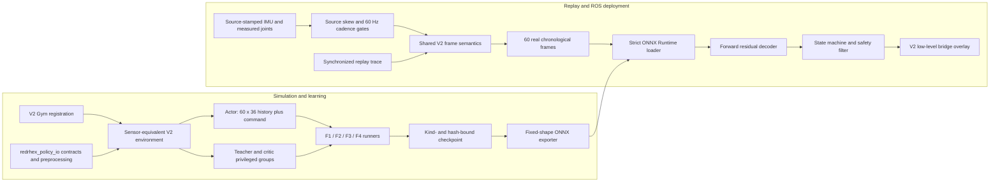

<a id="scope"></a>
## Scope

This audit traces the current executable V1 and Sensor-Only V2 paths from Gym registration through training, export, replay, ROS 2 inference, and the low-level bridge. It records code-path readiness and known blockers. The current hash-bound structural-plus-Isaac F0 baseline passed; this document does not claim successful F1-F5 training, recorded-hardware replay, calibrated robot deployment, or a physical-robot result.

The approved contract remains defined by the [Sensor-Only Student Distillation V2 design](../designs/active/2026-08-13-student-distillation-v2.en.md). The implementation and evidence work remains tracked by the [active plan](../plans/active/2026-08-13-student-distillation-v2.en.md).

<a id="method"></a>
## Method

The review followed explicit task and runner registrations, observation construction, actor/teacher/critic input selection, checkpoint transitions, ONNX export and loading, raw-event replay, ROS subscriptions, history/state transitions, calibration gates, and motor authorization. The dependency-light F0 structural command and an eight-environment, seed-42 Isaac zero-residual F0 rollout were run; the structural gate, simulator gate, and every command row passed. F1-F5 training, recorded real replay, ROS-on-hardware, and physical actuation were not run.

<a id="executable-routes"></a>
## Executable routes

V1 and V2 are selected explicitly; there is no dimension-based or automatic fallback between them.

| Boundary | V1 compatibility path | Sensor V2 path |
|---|---|---|
| Gym task | V1 registrations in `source/RedRhex/RedRhex/tasks/direct/redrhex/__init__.py` load `redrhex_env.py` and the V1 configurations. | `Template-Redrhex-ForwardSensorV2-Direct-v0` loads `redrhex_sensor_v2_env.py` and `redrhex_sensor_v2_env_cfg.py`. |
| Runner | `scripts/rsl_rl/runner_factory.py` selects the upstream-compatible `OnPolicyRunner` or `DistillationRunner`. | The same allowlist selects `VersionedTeacherRunnerV2`, `SensorDistillationRunnerV2`, `SensorOnPolicyRunnerV2`, or `SensorRobustnessRunnerV2`; `source/RedRhex/RedRhex/tasks/direct/redrhex/agents/sensor_v2/runner_factory.py` also gates the supported RSL-RL version and checkpoint kind. |
| Sequential training | V1 continues through the existing `scripts/rsl_rl/train.py` route. | `scripts/rsl_rl/train_sensor_v2_pipeline.py` is an ungated F0-F3 debugging lineage: it fails by default without `--acknowledge-ungated-debug`, skips the F1/F2 acceptance screens, and records `debug_only=true`, `deployment_eligible=false`, `promotion_eligible=false`, and `acceptance_screening=not_run_debug_only`. `scripts/rsl_rl/train_sensor_v2_full_pipeline.py` is the only promotion route; it is the fail-closed three-seed F0-F5 pipeline with F4 robustness and distinct held-out F5 evaluation. Neither route has an F0 bypass. |
| Training Panel | The standard browser route remains separately selected. | The Panel exposes `sensor_v2_full` as the evidence-gated F0-F5 route, explicit F1/F2/F3 single-stage recovery routes, and `sensor_v2_ungated_debug` as the clearly labeled non-promotable F0-F3 route. New `sensor_v2_f1_f3` launches are rejected. Historical runs under that retired name remain read-only recovery records, with derived `debug_only=true`, `deployment_eligible=false`, `promotion_eligible=false`, and `acceptance_screening=not_run_legacy_debug_only` markers. |
| ROS inference | `rl_controller_node.py`, `observation_builder.py`, `policy_onnx_runner.py`, `config/redrhex_policy.yaml`, and `launch/redrhex_policy_bringup.launch.py`. | `rl_controller_node_v2.py`, `observation_builder_v2.py`, `policy_onnx_runner_v2.py`, `preflight_check_v2.py`, `config/redrhex_policy_sensor_v2.yaml`, and `launch/redrhex_policy_sensor_v2.launch.py`. |
| Bridge | The V1 bridge configuration remains unchanged. | `ros2_ws/src/redrhex_lowlevel_bridge/config/lowlevel_bridge_sensor_v2.yaml` is a separate, fail-closed overlay. |

The V1 policy frame is 56-D: base linear velocity (3), base angular velocity (3), projected gravity (3), main-position sine/cosine (12), main velocity (6), ABAD position/velocity (12), command (3), gait sine/cosine (2), and previous action (12). V1 policy configurations concatenate the current frame with four previous frames for a 280-D actor input. The V1 ROS builder can default base velocity to zero, use commanded ABAD state, fill missing velocity values, and zero-pad an incomplete history. Those compatibility behaviors remain available only on the named V1 route and are forbidden on V2.

<a id="architecture"></a>
## Architecture



`source/redrhex_policy_io` is the reusable seam shared by simulator, replay, exporter records, and ROS packaging. Deployment-specific composition stays in `ros2_ws/src/redrhex_rl_controller`; V1 files are not repurposed.

<a id="observation-contract"></a>
## Observation contract

The actor receives a fixed float32 `sensor_history` shaped `[60, 36]`, ordered oldest to newest at 60 Hz, plus a separate current float32 `command` shaped `[3]`. Normalization is part of the student model, not an external deployment guess.

| Slice or input | Width | Unit/meaning | Permitted source |
|---|---:|---|---|
| `body_gyro[0:3]` | 3 | rad/s in the policy body frame | IMU gyro transformed by the recorded mount transform |
| `projected_gravity[3:6]` | 3 | unit gravity direction in the policy body frame | One explicit attitude mode: validated quaternion or causal gyro/accelerometer estimator |
| `main_position_sin[6:12]` | 6 | sine of continuous main-drive angle | Six calibrated measured main encoders |
| `main_position_cos[12:18]` | 6 | cosine of continuous main-drive angle | Six calibrated measured main encoders |
| `main_velocity[18:24]` | 6 | rad/s | Explicitly validated measured velocity or wrapped causal position difference |
| `abad_position[24:30]` | 6 | rad, neutral-relative | Six calibrated measured ABAD encoders |
| `abad_velocity[30:36]` | 6 | rad/s | Causal non-wrapped difference for bounded ABAD joints |
| `sensor_history` | 60 x 36 | one second, oldest to newest | Sixty actual chronological frames; an incomplete buffer is never exposed as ready |
| `command` | 3 | current `(vx, vy, wz)` request | Separate current command input; not copied into history |

True base linear velocity, odometry, gait clock, previous action, commanded ABAD, internal joint targets, and simulator dynamics parameters are forbidden actor inputs. Linear acceleration may update the causal attitude estimator but is not an actor feature. Source time must be monotonic and fresh. A frame is accepted only after the IMU and all twelve joint sources advance as one complete generation. The checked-in bound limits their maximum source-time skew to half a 60 Hz period and each channel's generation period to within 25% of `1/60 s`. A repeated or incomplete generation, source-skew or cadence violation, stale/future sample, missing or invalid joint diagnostic, or excessive history gap resets the V2 history and velocity baseline rather than inserting a fabricated value.

Validated-quaternion mode requires the declared IMU frame, mount transform, quaternion norm bound, recorded rest-gravity evidence, and finite known covariance below the configured variance limit. An all-zero covariance is treated as unknown and rejected. Causal gyro/accelerometer mode is an explicit alternative, never an implicit fallback.

<a id="learning-boundaries"></a>
## Teacher, critic, and actor boundaries

| Stage | Policy input | Privileged input and purpose |
|---|---|---|
| F1 Teacher A | Current 65-D `teacher_physical_v2` state | The 36-D current sensor frame and command plus true base velocity, base height, actuator strengths, fault mask, mass, friction, terrain, and disturbance. It trains the privileged teacher only. |
| F1 Teacher B ablation | 77-D isolated research input | Teacher A state plus twelve internal drive/ABAD targets. It is not a deployable teacher and is not silently substituted for Teacher A. |
| F2 distilled student | `sensor_history_v2 [60,36]` plus `command_v2 [3]` | Teacher A supplies action/latent targets; true base velocity and next frame are auxiliary labels only. They never enter the student actor. |
| F3 asymmetric PPO | `sensor_history_v2 [60,36]` plus `command_v2 [3]` | `critic_privileged_v2 [65]` is critic-only. Annealed Teacher A behavior cloning and persistent velocity/dynamics auxiliaries may shape training without changing actor inputs. |
| F4 robustness PPO | The same sensor-only actor inputs | `SensorRobustnessRunnerV2` accepts only a compatible F3/F4 PPO checkpoint through `--ppo_checkpoint`, starts a fresh optimizer, and applies a SHA-pinned `training_curriculum` profile. |

The student is a causal four-block TCN with kernel 5, dilations 1/2/4/8, width and latent size 64, and a 61-frame receptive field applied to the 60-frame window. Its deployment outputs are twelve actions and a three-value base-velocity estimate. The first six actions are bounded residuals around the versioned forward procedural decoder; the final six ABAD outputs are forced neutral/zero by the contract and deployment runner.

There is no validated V2 training contact label. The legacy locomotion contact sensor is disabled and its phase-derived contact state is not ground truth. Therefore V2 has no contact head, contact loss remains hard-disabled, export metadata says `contact_supervision=disabled`, and the ROS loader rejects a `contact_belief` output.

<a id="deployment-path"></a>
## ROS runtime, calibration, history, and safety

`rl_controller_node_v2.py` composes `SensorObservationBuilderV2`, `SensorPolicyONNXRunnerV2`, `ForwardResidualActionDecoderV2`, the controller state machine, deployment guard, and safety filter. It consumes source-stamped `/imu/data`, `/joint_states`, and `/redrhex/joint_feedback_status_v2`; the external `Twist` command uses local arrival time because the message is unstamped. The node has no odometry subscription, no commanded-ABAD fallback, and no fake base-velocity feature.

Startup policy enable and motor output are both false. During `WARMUP`, the node consumes one real generation to prime causal velocity and then accumulates 60 accepted generations; the baseline is not inserted as a fake history frame. Source skew and per-channel source cadence are checked before every append, so a 30 Hz stream cannot fill a nominal one-second 60 Hz history. A timing violation clears history and requires a new physical baseline. Policy readiness does not authorize motors. Motor enable additionally requires a safe controller state, no E-stop, fresh heartbeat and motor feedback, `hardware_gate.allow_motor_enable=true`, an ONNX bundle whose calibration profile is hardware-ready, and an exact configured-to-bundle action envelope. Dropout, timestamp, validity, inference, tilt, finite-action, current, temperature, or motor-fault failures hold or enter a protective state and clear enable latches as applicable. Any runtime action clipping, slew limiting, or velocity-limit tightening that changes a bundle target immediately makes the route incompatible, latches motor authorization off, and enters protective stop.

The V2 controller YAML deliberately ships with `UNVERIFIED` expected hashes, unverified IMU/rest-gravity and twelve-encoder evidence, `hardware_gate.allow_motor_enable=false`, a `9.0` rad/s main-drive velocity limit, and a `120.0` rad/s² slew rate. The simulator, exported bundle, and PhysX contract instead share a `15.0` rad/s action ceiling. The checked-in `9.0`/`120.0` values have no hardware evidence and do not authorize a tighter deployment envelope. The V2 bridge overlay deliberately defaults to the mock backend, unverified calibration, and motor authorization false. Provisional counts-per-radian or zero values are configuration candidates, not calibration evidence. Consequently the checked-in defaults cannot enable hardware.

`preflight_check_v2.py` verifies the exact V2 route and dimensions, joint order, attitude evidence, four expected hashes, decoder/action binding, disabled startup, bundle load, bundle calibration hardware readiness, exact configured action-clip and velocity-envelope equality with the bundle, and the combined motor guard. The checked-in `9.0` rad/s limit therefore conflicts with the `15.0` rad/s bundle target envelope and is a static motor-authorization blocker. Preflight never attempts motor enable and returns failure while any hardware blocker remains.

<a id="artifact-and-replay-gates"></a>
## ONNX, replay, and evidence gates

The V2 exporter in `source/RedRhex/RedRhex/tasks/direct/redrhex/agents/sensor_v2/export.py` writes fixed float32 inputs `sensor_history [1,60,36]` and `command [1,3]`, and fixed outputs `actions [1,12]` and `base_velocity_estimate [1,3]`. It deletes the artifact if Torch/ONNX Runtime parity fails. Embedded metadata and the JSON sidecar bind bundle schema/version, observation/action/calibration/feature-layout hashes, architecture and configuration hashes, checkpoint SHA-256, deployable checkpoint kind, and stage.

`policy_onnx_runner_v2.py` requires exact names, shapes, float32 dtypes, metadata keys, sidecar equality, contract/calibration records, and checkpoint-manifest kind/stage/architecture/config bindings. It accepts only distilled-student or PPO-student checkpoint kinds, supports an exact external checkpoint SHA pin, and can require hardware-ready calibration. V1's first-input/first-output behavior is not inherited.

`tools/sim2real/import_sensor_v2_rosbag.py` converts the four required raw ROS topics into the canonical synchronized `.npz`. It requires an exact observation-contract file/hash and a separately supplied `redrhex.sensor-v2-capture-attestation.v1` that binds the source bag hash, recorder/operator identifiers, UTC time, physical-hardware declaration, attitude mode, runtime calibration, and required topic types. The importer does not mint this attestation. It verifies the external declaration and writes a `redrhex.sensor-v2-rosbag-import.v1` receipt that hash-binds the bag, canonical trace, contract/mode, joint order, 60 Hz cadence, and at most `1/120 s` IMU/joint skew. The declaration is accountable hash-bound provenance, not cryptographic identity authentication.

`tools/sim2real/replay_student_observation_v2.py` reuses the contract frame builder and history buffer on the imported events. `--trace-kind real` requires the import receipt, independently supplied capture attestation, matching hardware-ready runtime calibration, matching contract/mode, and rehashes the source bag, trace, ONNX, and sidecar. It reads the checked-in canonical V2 controller YAML without an override, records its SHA-256, and uses the stateful ROS action decoder to recompute `raw_contract_target_main_drive_velocity`, `action_clipped_contract_target_main_drive_velocity`, `hardware_slew_target_main_drive_velocity`, and `hardware_target_main_drive_velocity`. Mandatory real-replay PASS requires element-wise total raw-to-final divergence fraction `0` and maximum absolute delta `0`; there is no waiver. Its summary binds the output NPZ as well. Before loading or rerunning replay sources, the promotion verifier requires the sensor-replay ONNX and sidecar SHA-256 values to be byte-identical to the canonical `torch_onnx_parity` verified sources; a distinct rehashed replay graph is rejected. It also rehashes the same canonical YAML, reloads the verified ONNX, reruns the canonical trace, and exactly compares every deterministic output array rather than trusting a self-reported PASS. Validated-quaternion imports require a unit quaternion and known nonzero covariance; causal gyro/accelerometer imports accept only the explicit ROS unavailable-orientation marker (`orientation_covariance[0] == -1`). The report includes timing, feature statistics, optional domain shift, policy latency, and saturation; it does not invent missing encoder signs, zeros, names, or clock alignment.

`tools/sim2real/sensor_dr_profile_v2.py` defines evidence-referenced, exact-SHA profiles with distinct `training_curriculum` and `held_out_evaluation` purposes. The loader resolves each evidence artifact relative to its profile and verifies the declared artifact SHA-256, so missing or modified evidence fails closed. Training and evaluation also reject a purpose mismatch, an unpinned profile, unknown ranges, neutral profiles, or overlapping physical fields from an independently selected physics profile. The full promotion pipeline additionally rejects F4/F5 reuse of a profile hash, `profile_id`, or any evidence-artifact hash. No measured profile or empirical F4/F5 result was supplied in this audit.

<a id="commands"></a>
## Reproducible commands

Run the current dependency-light F0 gate first:

```bash
python scripts/rsl_rl/validate_forward_gait_baseline.py \
  --json artifacts/sensor-v2/f0.json
```

This dependency-light command returns zero: all structural checks, including the supported same-phase reset, 65/35 time-warped duty cycle, 60 Hz timing, 0.9 Hz gait, 15 rad/s contract/PhysX ceiling, and saturating shared-decoder parity, pass. The current schema-v2 Isaac run used seed 42, eight environments, native springs, 120 settle steps, 120 warmup steps, and 240 measurement steps per command. Its immutable local report is `logs/rsl_rl/pipeline/evidence/redrhex-f0-isaac-2026-08-17-seed42-timewarp09-cycle-v2.json`, SHA-256 `2e108004c75e74e2e5df08d29ed8aac28b67f7cf8e5cc410135cd36975a70132`; structural, simulator, and all three command rows pass. The acceptance thresholds remain those in `eval_command_sweep.py`: velocity, lateral leak, and yaw leak use one command-scaled gait-cycle mean, while tilt, height, and episode-boundary safety remain pointwise. A 30/45/60-sample sensitivity check left the `0.22` m/s row failing; the exact full-cycle windows of 121/76/67 samples passed all commands. This F0 artifact is eligible for the full promotion pipeline, but no F1 run was started; the shorter example below is explicitly non-promotable debugging:

```bash
python scripts/rsl_rl/train_sensor_v2_pipeline.py \
  --isaaclab-launcher "${ISAACLAB_ROOT}/isaaclab.sh" \
  --headless --num_envs 64 --seed 42 --spring-backend native --acknowledge-ungated-debug \
  --pipeline_id sensor_v2_seed42
```

The short pipeline has no `--skip-f0` option, but it intentionally omits F1/F2 acceptance screening and refuses to start unless `--acknowledge-ungated-debug` is explicit. It passes the exact F1 checkpoint to F2 with `--teacher_checkpoint`, then the exact F2 checkpoint to F3 with `--student_checkpoint`, and writes the four non-eligibility markers named above. Its checkpoints cannot be promotion or deployment evidence; only the full route below can produce promotion evidence.

Use the full F0-F5 promotion route only with immutable passing Isaac F0 evidence, separate measured F4/F5 profiles, and at least three unique seeds:

```bash
python scripts/rsl_rl/train_sensor_v2_full_pipeline.py \
  --isaaclab-launcher "${ISAACLAB_ROOT}/isaaclab.sh" \
  --f0-evidence "${SENSOR_V2_F0_REPORT}" \
  --f0-evidence-sha256 "${SENSOR_V2_F0_REPORT_SHA256}" \
  --f4-profile "${SENSOR_V2_TRAINING_PROFILE}" \
  --f4-profile-sha256 "${SENSOR_V2_TRAINING_PROFILE_SHA256}" \
  --f5-profile "${SENSOR_V2_HELD_OUT_PROFILE}" \
  --f5-profile-sha256 "${SENSOR_V2_HELD_OUT_PROFILE_SHA256}" \
  --seeds 42 43 44 --num_envs 64 --pipeline-id sensor_v2_promotion
```

The route trains and nominally screens F1-F4 per seed, then screens F4 under the independently evidenced F5 domain. Even a completed simulation report writes `deployment_eligible=false`; recorded replay, hardware-ready calibration, preflight, and explicit operator authorization remain separate requirements.

Evaluate a named, hash-pinned F3 checkpoint only in an attested Isaac environment:

```bash
"${ISAACLAB_ROOT}/isaaclab.sh" -p scripts/rsl_rl/eval_command_sweep.py \
  --task Template-Redrhex-ForwardSensorV2-Direct-v0 \
  --agent rsl_rl_ppo_v2_cfg_entry_point \
  --checkpoint "${SENSOR_V2_CHECKPOINT}" \
  --checkpoint-sha256 "${SENSOR_V2_CHECKPOINT_SHA256}" \
  --sensor-dr-profile "${SENSOR_V2_HELD_OUT_PROFILE}" \
  --sensor-dr-profile-sha256 "${SENSOR_V2_HELD_OUT_PROFILE_SHA256}" \
  --strict-checkpoint-loading --spring-backend native \
  --eval_profile stage1 --num_envs 256 --seed 42 --headless \
  --csv artifacts/sensor-v2/f3-command-sweep.csv
```

Continue F3 into F4 only with a reviewed, hash-pinned training profile:

```bash
"${ISAACLAB_ROOT}/isaaclab.sh" -p scripts/rsl_rl/train.py \
  --task Template-Redrhex-ForwardSensorV2-Direct-v0 \
  --agent rsl_rl_robust_ppo_v2_cfg_entry_point \
  --ppo_checkpoint "${SENSOR_V2_F3_CHECKPOINT}" \
  --sensor-dr-profile "${SENSOR_V2_TRAINING_PROFILE}" \
  --sensor-dr-profile-sha256 "${SENSOR_V2_TRAINING_PROFILE_SHA256}" \
  --spring-backend native --num_envs 64 --seed 42 --headless
```

Export the exact completed F4 robustness checkpoint through the V2 exporter:

```bash
"${ISAACLAB_ROOT}/isaaclab.sh" -p scripts/rsl_rl/play.py \
  --task Template-Redrhex-ForwardSensorV2-Direct-v0 \
  --agent rsl_rl_robust_ppo_v2_cfg_entry_point \
  --checkpoint "${SENSOR_V2_F4_CHECKPOINT}" \
  --spring-backend native --num_envs 1 --headless --export_policy_only
```

Generate the three source-verifiable promotion artifacts only when the ONNX embedded metadata, sidecar metadata, embedded checkpoint manifest, and sidecar checkpoint manifest all identify the exact `ppo_f4` checkpoint, together with a hash-pinned recorded parity input:

```bash
python tools/sim2real/generate_sensor_v2_promotion_gates.py \
  --onnx artifacts/sensor-v2/policy.onnx \
  --sidecar artifacts/sensor-v2/policy.onnx.json \
  --checkpoint "${SENSOR_V2_F4_CHECKPOINT}" \
  --parity-input artifacts/sensor-v2/parity-input.npz \
  --parity-input-sha256 "${SENSOR_V2_PARITY_INPUT_SHA256}" \
  --output-dir artifacts/sensor-v2/promotion-gates
```

This command rejects `ppo_f3` or any embedded/sidecar stage disagreement; only exact `ppo_f4` provenance is promotion-eligible. It strictly reloads the checkpoint actor and reruns Torch-versus-ONNX comparison on fixed random inputs and the recorded NPZ. It emits `no_privileged_leak_v2.json`, `torch_onnx_parity_v2.json`, and `contract_provenance_v2.json`; the final gap verifier rehashes their sources and recomputes parity instead of accepting a self-reported status.

Import an attested recorded bag, then replay the synchronized trace through the shared preprocessing and strict bundle:

```bash
python tools/sim2real/import_sensor_v2_rosbag.py \
  "${SENSOR_V2_BAG_DIR}" artifacts/sensor-v2/real-trace.npz \
  --receipt artifacts/sensor-v2/real-trace.receipt.json \
  --observation-contract "${SENSOR_V2_OBSERVATION_CONTRACT}" \
  --observation-contract-sha256 "${SENSOR_V2_OBSERVATION_CONTRACT_SHA256}" \
  --capture-attestation "${SENSOR_V2_CAPTURE_ATTESTATION}" \
  --capture-attestation-sha256 "${SENSOR_V2_CAPTURE_ATTESTATION_SHA256}"

python tools/sim2real/replay_student_observation_v2.py \
  artifacts/sensor-v2/real-trace.npz \
  --onnx artifacts/sensor-v2/policy.onnx \
  --sidecar artifacts/sensor-v2/policy.onnx.json \
  --trace-kind real \
  --import-receipt artifacts/sensor-v2/real-trace.receipt.json \
  --import-receipt-sha256 "${SENSOR_V2_IMPORT_RECEIPT_SHA256}" \
  --output-npz artifacts/sensor-v2/real-replay.npz \
  --output-json artifacts/sensor-v2/real-replay.json
```

The replay command must fail if the receipt, attestation, observation contract/mode, bundle calibration, or canonical controller-YAML hash does not match, if calibration is not hardware-ready, or if any decoded target has nonzero raw-to-final divergence; neither the replay nor the gap verifier has an override. Only mocked conversion/receipt and actual-ONNX dependency-light tests were run here; no real bag, real replay, or hardware evidence was produced, so the recorded replay gate remains blocked and not run. ROS preflight is likewise offline and fail-closed:

```bash
ros2 run redrhex_rl_controller preflight_check_v2 \
  --config ros2_ws/src/redrhex_rl_controller/config/redrhex_policy_sensor_v2.yaml \
  --onnx artifacts/sensor-v2/policy.onnx \
  --sidecar artifacts/sensor-v2/policy.onnx.json
```

<a id="evidence-status"></a>
## Evidence status

| Gate | Current status | Evidence and interpretation |
|---|---|---|
| Executable V2 registration, runner, replay, exporter, and ROS composition | Implemented; not a promotion PASS | The named source, launch, configuration, packaging, and dependency-light test paths exist. Code presence does not prove a trained policy or hardware behavior. |
| F0 deterministic structural gate | **PASS** on 2026-08-17 | The earlier schema-v1 interpretation incorrectly required a π-separated physical reset. The supported reset instead puts every effective leg phase at `-π/4` (reported modulo `2π` as `5.497787143782138` rad); the π tripod offset belongs to the time-warped CPG reference. The uniform-angle replacement sent all six legs through recovery together and collapsed. Schema v2 restores the historical 65% stance/35% recovery map, a motion-relative command-scaled clock with `0.40` m/s reference, phase-lock gain `1.2`, the 0.9 Hz setting selected by a 27-candidate diagnostic sweep, and a `15.0` rad/s simulator/bundle action ceiling bound to PhysX. This is an exact parity contract, not permission for ROS to tighten targets. The checked-in YAML instead carries an unevidenced `9.0` rad/s limit and `120.0` rad/s² slew rate: the velocity mismatch statically blocks motor authorization, and any slew that changes a target is runtime tightening. Stale v1 evidence is rejected. |
| Current Isaac F0 | **PASS** on 2026-08-17 | In the seed-42, eight-environment native-spring rollout, command `0.22` m/s produced `(vx, |vy|, |wz|)=(0.15555385, 0.03696116, 0.05235866)`, forward MAE `0.08331826`, minimum height `0.09331225` m, maximum tilt `0.02347615` rad, zero falls, and contiguous ratio `1.0` with window 121. The `0.35` row produced `(0.28883586, 0.04756304, 0.13905468)`, MAE `0.14457848`, height `0.09625660` m, tilt `0.05174746` rad, zero falls, ratio `1.0`, window 76. The `0.42` row produced `(0.35532615, 0.05363585, 0.20592422)`, MAE `0.17990564`, height `0.09447639` m, tilt `0.06365142` rad, zero falls, ratio `1.0`, window 67. Report schema: `redrhex.forward-gait-f0.v2`; SHA-256: `2e108004c75e74e2e5df08d29ed8aac28b67f7cf8e5cc410135cd36975a70132`. |
| F1/F2/F3/F4/F5 training and command evaluation | `NOT_RUN` | Only F0 was executed. No production-length or three-seed training, measured training profile, held-out Sensor DR profile, or F1-F5 command evaluation was run; earlier one-update smoke notes are not acceptance evidence. |
| Torch/ONNX bundle parity on a promoted checkpoint | `NOT_RUN` | The fail-closed exporter and loader exist, but no exact `ppo_f4` embedded-plus-sidecar candidate was generated or accepted here; an F3 artifact cannot enter promotion. |
| Recorded real-trace replay and ROS offline parity | `BLOCKED`; `NOT_RUN` | No recorded real trace or promoted deployment artifact was supplied. The mandatory stateful-decoder check is bound to the canonical controller YAML and requires element-wise total divergence fraction `0` and maximum delta `0`, without override. |
| V2 contact supervision | `BLOCKED` | No validated V2 training contact labels exist; supervision and output remain disabled. |
| Hardware calibration, preflight, and physical actuation | `BLOCKED`; tests `NOT_RUN` | Checked-in calibration and hardware gates are deliberately unverified/false. The unevidenced YAML contains a `9.0` rad/s limit and `120.0` rad/s² slew rate; its velocity-limit mismatch with the `15.0` rad/s bundle/PhysX contract statically blocks motor authorization. Runtime target clipping, slew limiting, or velocity tightening also latches authorization off and enters protective stop. No hardware evidence or physical test was run, and no motor enable was attempted. |

<a id="findings"></a>
## Findings

- V2 is now a real additive executable route in training, replay, export, and ROS; the previous absence of a V2 ROS composition path is resolved without changing V1.
- The V2 actor boundary is sensor-only. Simulator truth and internal targets remain confined to teacher, critic, reward/evaluation, or auxiliary-label paths.
- V1 remains intentionally non-deployable as a V2 sensor contract because it contains privileged simulator velocity, gait phase, previous action, and permissive ROS placeholders/fallbacks.
- The shared contract/preprocessor/history package is the principal parity seam. Exact hashes and checkpoint records extend that seam through ONNX and installed ROS packages.
- The former F0 issue was a contract/validator migration error plus lost historical gait time-warp, not a need for a π-separated physical reset. The schema-v2 structural and Isaac F0 gates now pass, but F1-F5 remain unstarted; ONNX, replay, and ROS/hardware promotion cannot be inferred from F0.
- Hardware remains blocked by missing reviewed IMU frame/rest-gravity and all-twelve-encoder calibration evidence, plus the checked-in `9.0` rad/s action envelope mismatch with the `15.0` rad/s bundle contract. Configuration values alone are not proof, and runtime tightening is a protective-stop condition rather than an allowed ROS override.
- Contact supervision must remain disabled until a separately validated label source and contract change are reviewed.

<a id="actions"></a>
## Actions

- [x] Preserve named V1 tasks, runner selection, observation builder, ONNX runner, YAML, and launch route.
- [x] Wire the additive V2 task, strict runners, shared 36-D/60-frame contract, exporter, replay tool, ROS node, separate launch/YAML, and bridge overlay.
- [x] Restore the supported same-phase reset, historical 65/35 time-warp, and bounded motion-relative phase lock; rerun the schema-v2 structural gate.
- [x] Produce immutable structural-plus-Isaac F0 evidence in which every command passes; retain three-seed F1/F2/F3/F4 training and independent held-out F5 command gates as separate work.
- [ ] Produce a current exact-`ppo_f4`, hash-bound student bundle and pass Torch/ONNX plus canonical-YAML-bound recorded replay and ROS offline parity with zero element-wise action-target divergence.
- [ ] Prove the selected IMU attitude mode and all twelve encoder calibrations from reviewed recorded evidence.
- [ ] Keep motor authorization false until bundle calibration is hardware-ready, the configured action envelope exactly matches the bundle under reviewed hardware evidence, preflight passes, and a separately approved physical test is executed.

<a id="evidence"></a>
## Evidence

Primary executable evidence is in `source/RedRhex/RedRhex/tasks/direct/redrhex/__init__.py`, `source/RedRhex/RedRhex/tasks/direct/redrhex/redrhex_sensor_v2_env.py`, `source/RedRhex/RedRhex/tasks/direct/redrhex/agents/sensor_v2/`, `source/redrhex_policy_io/redrhex_policy_io/`, `scripts/rsl_rl/runner_factory.py`, `scripts/rsl_rl/train.py`, `scripts/rsl_rl/train_sensor_v2_pipeline.py`, `scripts/rsl_rl/train_sensor_v2_full_pipeline.py`, `scripts/rsl_rl/validate_forward_gait_baseline.py`, `scripts/rsl_rl/eval_command_sweep.py`, `tools/sim2real/sensor_dr_profile_v2.py`, and `tools/sim2real/replay_student_observation_v2.py`.

Deployment evidence is in `ros2_ws/src/redrhex_policy_io/`, `ros2_ws/src/redrhex_rl_controller/redrhex_rl_controller/rl_controller_node_v2.py`, `observation_builder_v2.py`, `policy_onnx_runner_v2.py`, `preflight_check_v2.py`, `launch/redrhex_policy_sensor_v2.launch.py`, `config/redrhex_policy_sensor_v2.yaml`, and `ros2_ws/src/redrhex_lowlevel_bridge/config/lowlevel_bridge_sensor_v2.yaml`. V1 comparison evidence remains in the corresponding unversioned controller files and `redrhex_env.py`/`redrhex_env_cfg.py`.

<a id="documentation-impact"></a>
## Documentation impact

- Document type and location: maintained research audit in `docs/research/`; implementation status is synchronized in the existing active plan in `docs/plans/active/`.
- Locale pair: this English document and `2026-08-13-student-distillation-v2-audit.zh-TW.md` carry matching metadata, anchors, and meaning; the active plan pair is updated in the same change.
- Navigation and migration: no document was added, moved, renamed, or retired, so navigation manifests and migration stubs are unchanged.
- Design impact: the approved design is unchanged because its fixed 60 Hz timestamp/history contract and fail-closed safety boundary already require this behavior; this revision records their concrete timing enforcement together with executable-path and evidence status.

<a id="follow-up"></a>
## Follow-up

Re-audit after each F1-F5 gate has a current immutable report. Also re-audit any change to actor features, history semantics, source-timing bounds, attitude mode, action decoder, calibration profile, runner role, checkpoint manifest, ONNX I/O, or motor authorization. F0 is `PASS`; later empirical and hardware evidence remain `NOT_RUN`, contact remains blocked, and the checked-in V2 deployment remains disabled by default.
