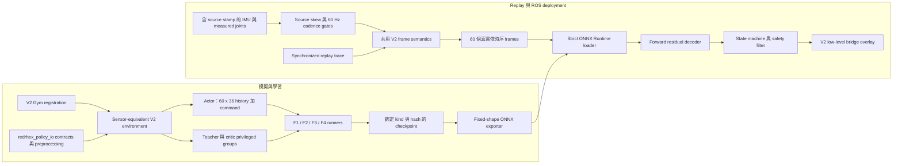

<a id="scope"></a>
## 範圍

本稽核追蹤目前可執行的 V1 與 Sensor-Only V2 路徑，從 Gym registration 一路到 training、export、replay、ROS 2 inference 與 low-level bridge。本文記錄程式路徑的就緒程度與已知阻擋項目。目前以 hash 綁定的 structural-plus-Isaac F0 baseline 已通過；本文不宣稱已有成功的 F1-F5 training、recorded-hardware replay、完成校正的機器人部署或實體機器人成果。

核准的 contract 仍由 [Sensor-Only Student Distillation V2 設計](../designs/active/2026-08-13-student-distillation-v2.zh-TW.md)定義。實作與證據工作仍由[現行計畫](../plans/active/2026-08-13-student-distillation-v2.zh-TW.md)追蹤。

<a id="method"></a>
## 方法

檢視範圍包含明確的 task 與 runner registrations、observation construction、actor/teacher/critic input selection、checkpoint transitions、ONNX export 與 loading、raw-event replay、ROS subscriptions、history/state transitions、calibration gates 與 motor authorization。已執行 dependency-light F0 structural command，以及 seed 42、八個 environments 的 Isaac zero-residual F0 rollout；structural gate、simulator gate 與每個 command row 都通過。F1-F5 training、recorded real replay、ROS-on-hardware 與 physical actuation 均未執行。

<a id="executable-routes"></a>
## 可執行路徑

V1 與 V2 都必須明確選取；兩者之間沒有以維度判斷或自動切換的 fallback。

| 邊界 | V1 相容路徑 | Sensor V2 路徑 |
|---|---|---|
| Gym task | `source/RedRhex/RedRhex/tasks/direct/redrhex/__init__.py` 的 V1 registrations 會載入 `redrhex_env.py` 與 V1 configurations。 | `Template-Redrhex-ForwardSensorV2-Direct-v0` 會載入 `redrhex_sensor_v2_env.py` 與 `redrhex_sensor_v2_env_cfg.py`。 |
| Runner | `scripts/rsl_rl/runner_factory.py` 選取 upstream-compatible `OnPolicyRunner` 或 `DistillationRunner`。 | 同一 allowlist 選取 `VersionedTeacherRunnerV2`、`SensorDistillationRunnerV2`、`SensorOnPolicyRunnerV2` 或 `SensorRobustnessRunnerV2`；`source/RedRhex/RedRhex/tasks/direct/redrhex/agents/sensor_v2/runner_factory.py` 也會限制支援的 RSL-RL version 與 checkpoint kind。 |
| Sequential training | V1 繼續使用既有 `scripts/rsl_rl/train.py` 路徑。 | `scripts/rsl_rl/train_sensor_v2_pipeline.py` 是 ungated F0-F3 debugging lineage：沒有 `--acknowledge-ungated-debug` 時預設拒絕執行、略過 F1/F2 acceptance screens，並記錄 `debug_only=true`、`deployment_eligible=false`、`promotion_eligible=false` 與 `acceptance_screening=not_run_debug_only`。`scripts/rsl_rl/train_sensor_v2_full_pipeline.py` 是唯一的 promotion route；此 fail-closed three-seed F0-F5 pipeline 另含 F4 robustness 與獨立 held-out F5 evaluation。兩條 route 都沒有 F0 bypass。 |
| Training Panel | Standard browser route 維持獨立選取。 | Panel 將 `sensor_v2_full` 作為 evidence-gated F0-F5 route，另提供明確的 F1/F2/F3 single-stage recovery routes，以及清楚標示為不可 promotion 的 F0-F3 `sensor_v2_ungated_debug` route。新的 `sensor_v2_f1_f3` launch 會被拒絕；該 retired 名稱下的 historical runs 只保留 read-only recovery record，並衍生 `debug_only=true`、`deployment_eligible=false`、`promotion_eligible=false` 與 `acceptance_screening=not_run_legacy_debug_only` markers。 |
| ROS inference | `rl_controller_node.py`、`observation_builder.py`、`policy_onnx_runner.py`、`config/redrhex_policy.yaml` 與 `launch/redrhex_policy_bringup.launch.py`。 | `rl_controller_node_v2.py`、`observation_builder_v2.py`、`policy_onnx_runner_v2.py`、`preflight_check_v2.py`、`config/redrhex_policy_sensor_v2.yaml` 與 `launch/redrhex_policy_sensor_v2.launch.py`。 |
| Bridge | V1 bridge configuration 維持不變。 | `ros2_ws/src/redrhex_lowlevel_bridge/config/lowlevel_bridge_sensor_v2.yaml` 是獨立且 fail-closed 的 overlay。 |

V1 policy frame 為 56-D：base linear velocity（3）、base angular velocity（3）、projected gravity（3）、main-position sine/cosine（12）、main velocity（6）、ABAD position/velocity（12）、command（3）、gait sine/cosine（2）與 previous action（12）。V1 policy configurations 將 current frame 與四個 previous frames 串接成 280-D actor input。V1 ROS builder 可以把 base velocity 預設為零、使用 commanded ABAD state、補上缺少的 velocity 值，並以零填充不完整 history。這些相容行為只保留在具名 V1 路徑，V2 明確禁止。

<a id="architecture"></a>
## 架構



`source/redrhex_policy_io` 是 simulator、replay、exporter records 與 ROS packaging 共用的 reusable seam。Deployment-specific composition 留在 `ros2_ws/src/redrhex_rl_controller`；V1 files 不會被改作 V2 使用。

<a id="observation-contract"></a>
## Observation contract

Actor 接收固定 float32 `sensor_history`，shape 為 `[60, 36]`，以 60 Hz 從最舊排到最新；另有獨立的 current float32 `command`，shape 為 `[3]`。Normalization 是 student model 的一部分，不由 deployment 在外部猜測。

| Slice 或 input | 寬度 | 單位／意義 | 允許來源 |
|---|---:|---|---|
| `body_gyro[0:3]` | 3 | policy body frame 的 rad/s | 以有紀錄的 mount transform 轉換 IMU gyro |
| `projected_gravity[3:6]` | 3 | policy body frame 的單位重力方向 | 一個明確 attitude mode：validated quaternion 或 causal gyro/accelerometer estimator |
| `main_position_sin[6:12]` | 6 | continuous main-drive angle 的 sine | 六個完成校正的 measured main encoders |
| `main_position_cos[12:18]` | 6 | continuous main-drive angle 的 cosine | 六個完成校正的 measured main encoders |
| `main_velocity[18:24]` | 6 | rad/s | 明確驗證過的 measured velocity，或 wrapped causal position difference |
| `abad_position[24:30]` | 6 | rad，相對 neutral | 六個完成校正的 measured ABAD encoders |
| `abad_velocity[30:36]` | 6 | rad/s | Bounded ABAD joints 的 causal non-wrapped difference |
| `sensor_history` | 60 x 36 | 一秒，從最舊到最新 | 六十個真實且依時序的 frames；不完整 buffer 絕不會顯示為 ready |
| `command` | 3 | current `(vx, vy, wz)` request | 獨立 current command input；不複製到 history |

True base linear velocity、odometry、gait clock、previous action、commanded ABAD、internal joint targets 與 simulator dynamics parameters 都是 actor 禁用輸入。Linear acceleration 可以更新 causal attitude estimator，但不是 actor feature。Source time 必須單調遞增且保持 fresh。只有 IMU 與全部十二個 joint sources 都前進成一個完整 generation 後，frame 才會被接受。Checked-in bound 把最大 source-time skew 限制為 60 Hz period 的一半，並把每個 channel 的 generation period 限制在 `1/60 s` 的 25% 內。Repeated 或 incomplete generation、source-skew 或 cadence violation、stale/future sample、缺少或無效的 joint diagnostic，或過大的 history gap，都會重設 V2 history 與 velocity baseline，而不會插入捏造值。

Validated-quaternion mode 要求宣告的 IMU frame、mount transform、quaternion norm bound、recorded rest-gravity evidence，以及低於設定 variance limit 的 finite known covariance。全零 covariance 視為 unknown 並拒絕。Causal gyro/accelerometer mode 是明確的替代方案，絕不是隱含 fallback。

<a id="learning-boundaries"></a>
## Teacher、critic 與 actor 邊界

| 階段 | Policy input | Privileged input 與用途 |
|---|---|---|
| F1 Teacher A | Current 65-D `teacher_physical_v2` state | 36-D current sensor frame 與 command，加上 true base velocity、base height、actuator strengths、fault mask、mass、friction、terrain 與 disturbance。只用於訓練 privileged teacher。 |
| F1 Teacher B ablation | 77-D 隔離的 research input | Teacher A state 加十二個 internal drive/ABAD targets。它不是可部署 teacher，也不會暗中取代 Teacher A。 |
| F2 distilled student | `sensor_history_v2 [60,36]` 加 `command_v2 [3]` | Teacher A 提供 action/latent targets；true base velocity 與 next frame 只作 auxiliary labels，絕不進入 student actor。 |
| F3 asymmetric PPO | `sensor_history_v2 [60,36]` 加 `command_v2 [3]` | `critic_privileged_v2 [65]` 只供 critic 使用。Annealed Teacher A behavior cloning 與持續的 velocity/dynamics auxiliaries 可以影響 training，但不改變 actor inputs。 |
| F4 robustness PPO | 相同的 sensor-only actor inputs | `SensorRobustnessRunnerV2` 只透過 `--ppo_checkpoint` 接受 compatible F3/F4 PPO checkpoint、使用 fresh optimizer，並套用 SHA-pinned `training_curriculum` profile。 |

Student 是 causal four-block TCN，kernel 為 5、dilations 為 1/2/4/8、width 與 latent size 為 64，並把 61-frame receptive field 套在 60-frame window。Deployment outputs 是十二個 actions 與三個 base-velocity estimate 值。前六個 actions 是 versioned forward procedural decoder 上的 bounded residuals；最後六個 ABAD outputs 由 contract 與 deployment runner 強制為 neutral/zero。

目前沒有經驗證的 V2 training contact label。Legacy locomotion contact sensor 已停用，其 phase-derived contact state 不是 ground truth。因此 V2 沒有 contact head、contact loss 維持 hard-disabled、export metadata 設為 `contact_supervision=disabled`，且 ROS loader 會拒絕 `contact_belief` output。

<a id="deployment-path"></a>
## ROS runtime、calibration、history 與 safety

`rl_controller_node_v2.py` 組合 `SensorObservationBuilderV2`、`SensorPolicyONNXRunnerV2`、`ForwardResidualActionDecoderV2`、controller state machine、deployment guard 與 safety filter。它使用含 source stamp 的 `/imu/data`、`/joint_states` 與 `/redrhex/joint_feedback_status_v2`；外部 `Twist` command 因 message 本身不含 stamp，使用 local arrival time。Node 沒有 odometry subscription、沒有 commanded-ABAD fallback，也沒有 fake base-velocity feature。

Startup policy enable 與 motor output 都是 false。在 `WARMUP` 期間，node 先消耗一個真實 generation 作為 causal velocity baseline，再累積 60 個已接受的 generations；baseline 不會被插入成 fake history frame。每次 append 前都會檢查 source skew 與 per-channel source cadence，因此 30 Hz stream 無法填滿名義上一秒的 60 Hz history。Timing violation 會清除 history，並要求新的 physical baseline。Policy readiness 不等於 motor authorization。Motor enable 還要求安全的 controller state、沒有 E-stop、fresh heartbeat 與 motor feedback、`hardware_gate.allow_motor_enable=true`、calibration profile 為 hardware-ready 的 ONNX bundle，以及 configured-to-bundle action envelope 完全一致。Dropout、timestamp、validity、inference、tilt、finite-action、current、temperature 或 motor-fault 失敗時，系統會維持或進入 protective state，並依情況清除 enable latches。Runtime 中任何會改變 bundle target 的 action clipping、slew limiting 或 velocity-limit tightening，都會立即使 route incompatible、將 motor authorization latch off，並進入 protective stop。

V2 controller YAML 刻意以 `UNVERIFIED` 作為 expected hashes，IMU/rest-gravity 與十二個 encoder evidence 都未驗證，並設為 `hardware_gate.allow_motor_enable=false`、`9.0` rad/s main-drive velocity limit 與 `120.0` rad/s² slew rate。Simulator、exported bundle 與 PhysX contract 則共用 `15.0` rad/s action ceiling。Checked-in 的 `9.0`／`120.0` 值沒有 hardware evidence，也不構成收緊 deployment envelope 的授權。V2 bridge overlay 也刻意預設 mock backend、未驗證 calibration 與 false motor authorization。暫定的 counts-per-radian 或 zero 值只是 configuration candidates，不是 calibration evidence。因此 checked-in defaults 無法啟用 hardware。

`preflight_check_v2.py` 驗證確切 V2 route 與 dimensions、joint order、attitude evidence、四個 expected hashes、decoder/action binding、disabled startup、bundle load、bundle calibration hardware readiness、configured action-clip 與 velocity envelope 對 bundle 的完全相等，以及 combined motor guard。因此 checked-in 的 `9.0` rad/s limit 與 `15.0` rad/s bundle target envelope 衝突，形成 static motor-authorization blocker。Preflight 絕不嘗試 motor enable，而且任何 hardware blocker 存在時都會回傳失敗。

<a id="artifact-and-replay-gates"></a>
## ONNX、replay 與 evidence gates

`source/RedRhex/RedRhex/tasks/direct/redrhex/agents/sensor_v2/export.py` 的 V2 exporter 會寫入固定 float32 inputs `sensor_history [1,60,36]` 與 `command [1,3]`，以及固定 outputs `actions [1,12]` 與 `base_velocity_estimate [1,3]`。Torch/ONNX Runtime parity 失敗時會刪除 artifact。Embedded metadata 與 JSON sidecar 綁定 bundle schema/version、observation/action/calibration/feature-layout hashes、architecture 與 configuration hashes、checkpoint SHA-256、可部署 checkpoint kind 與 stage。

`policy_onnx_runner_v2.py` 要求完全一致的 names、shapes、float32 dtypes、metadata keys、sidecar equality、contract/calibration records，以及 checkpoint-manifest kind/stage/architecture/config bindings。它只接受 distilled-student 或 PPO-student checkpoint kinds，支援外部指定 exact checkpoint SHA pin，也可以要求 hardware-ready calibration。V1 的 first-input/first-output 行為不會沿用。

`tools/sim2real/import_sensor_v2_rosbag.py` 會將四個必要 raw ROS topics 轉換成 canonical synchronized `.npz`。它要求 exact observation-contract file/hash，以及另行提供的 `redrhex.sensor-v2-capture-attestation.v1`；該 attestation 綁定 source bag hash、recorder/operator identifiers、UTC time、physical-hardware declaration、attitude mode、runtime calibration 與必要 topic types。Importer 不會自行產生此 attestation，而是驗證外部 declaration，再寫出 `redrhex.sensor-v2-rosbag-import.v1` receipt，將 bag、canonical trace、contract/mode、joint order、60 Hz cadence 與最多 `1/120 s` IMU/joint skew 以 hash 綁定。這是可問責的 hash-bound provenance，不是 cryptographic identity authentication。

`tools/sim2real/replay_student_observation_v2.py` 在 imported events 上重用 contract frame builder 與 history buffer。`--trace-kind real` 要求 import receipt、另行提供的 capture attestation、一致的 hardware-ready runtime calibration 與 contract/mode，並重新計算 source bag、trace、ONNX 與 sidecar 的 hash。它不提供 override，只讀取 checked-in canonical V2 controller YAML、記錄其 SHA-256，並使用 stateful ROS action decoder 重新計算 `raw_contract_target_main_drive_velocity`、`action_clipped_contract_target_main_drive_velocity`、`hardware_slew_target_main_drive_velocity` 與 `hardware_target_main_drive_velocity`。Mandatory real-replay PASS 要求 element-wise total raw-to-final divergence fraction 為 `0`，maximum absolute delta 也為 `0`；沒有 waiver。Summary 也綁定 output NPZ。在載入或重跑 replay sources 前，promotion verifier 要求 sensor-replay ONNX 與 sidecar 的 SHA-256 必須和 canonical `torch_onnx_parity` 已驗證來源達到 byte-identical；即使另行重新計算 hash，distinct replay graph 仍會被拒絕。它也會重新計算同一份 canonical YAML 的 hash、重新載入已驗證的 ONNX、重跑 canonical trace，並精確比對每個 deterministic output array，不信任 self-reported PASS。Validated-quaternion import 要求 unit quaternion 與已知非零 covariance；causal gyro/accelerometer import 只接受明確的 ROS orientation unavailable marker（`orientation_covariance[0] == -1`）。Report 包含 timing、feature statistics、optional domain shift、policy latency 與 saturation；它不會捏造缺少的 encoder signs、zeros、names 或 clock alignment。

`tools/sim2real/sensor_dr_profile_v2.py` 定義具有 evidence references 與 exact SHA 的 profiles，並區分 `training_curriculum` 與 `held_out_evaluation` purposes。Loader 會以 profile 所在位置解析每個 evidence artifact，並驗證宣告的 artifact SHA-256，因此 evidence 缺少或被修改時會 fail closed。Training 與 evaluation 也會拒絕 purpose mismatch、未 pin 的 profile、unknown ranges、neutral profiles，或與獨立選取 physics profile 重疊的 physical fields。Full promotion pipeline 另外拒絕 F4/F5 重用 profile hash、`profile_id` 或任何 evidence-artifact hash。本次稽核未提供 measured profile 或 empirical F4/F5 結果。

<a id="commands"></a>
## 可重現指令

先執行目前的 dependency-light F0 gate：

```bash
python scripts/rsl_rl/validate_forward_gait_baseline.py \
  --json artifacts/sensor-v2/f0.json
```

此 dependency-light command 回傳 zero：包含受支援的 same-phase reset、65/35 time-warped duty cycle、60 Hz timing、0.9 Hz gait、15 rad/s contract/PhysX ceiling，以及確實觸發 saturation 的 shared-decoder parity 在內，所有 structural checks 都通過。目前 schema-v2 Isaac 執行使用 seed 42、八個 environments、native springs、120 settle steps、120 warmup steps，以及每個 command 240 measurement steps。Immutable local report 為 `logs/rsl_rl/pipeline/evidence/redrhex-f0-isaac-2026-08-17-seed42-timewarp09-cycle-v2.json`，SHA-256 為 `2e108004c75e74e2e5df08d29ed8aac28b67f7cf8e5cc410135cd36975a70132`；structural、simulator 與三個 command rows 都通過。Acceptance thresholds 維持 `eval_command_sweep.py` 既有定義：velocity、lateral leak 與 yaw leak 使用一個 command-scaled gait cycle 的 mean，tilt、height 與 episode-boundary safety 則保持 pointwise。30/45/60-sample sensitivity check 下 `0.22` m/s row 仍失敗；使用 121/76/67 samples 的完整且精確 cycle window 時三個 commands 都通過。此 F0 artifact 可供完整 promotion pipeline 使用，但本次並未啟動 F1；以下較短的範例明確只供不可 promotion 的 debugging：

```bash
python scripts/rsl_rl/train_sensor_v2_pipeline.py \
  --isaaclab-launcher "${ISAACLAB_ROOT}/isaaclab.sh" \
  --headless --num_envs 64 --seed 42 --spring-backend native --acknowledge-ungated-debug \
  --pipeline_id sensor_v2_seed42
```

較短的 pipeline 沒有 `--skip-f0` option，但會刻意略過 F1/F2 acceptance screening，而且未明確提供 `--acknowledge-ungated-debug` 時拒絕啟動。它以 `--teacher_checkpoint` 將 exact F1 checkpoint 傳給 F2，再以 `--student_checkpoint` 將 exact F2 checkpoint 傳給 F3，並寫入上述四個 non-eligibility markers。其 checkpoints 不得作為 promotion 或 deployment evidence；只有下方完整 route 能產生 promotion evidence。

只有具備 immutable 且通過的 Isaac F0 evidence、分離的 measured F4/F5 profiles，以及至少三個 unique seeds 時，才可使用完整 F0-F5 promotion route：

```bash
python scripts/rsl_rl/train_sensor_v2_full_pipeline.py \
  --isaaclab-launcher "${ISAACLAB_ROOT}/isaaclab.sh" \
  --f0-evidence "${SENSOR_V2_F0_REPORT}" \
  --f0-evidence-sha256 "${SENSOR_V2_F0_REPORT_SHA256}" \
  --f4-profile "${SENSOR_V2_TRAINING_PROFILE}" \
  --f4-profile-sha256 "${SENSOR_V2_TRAINING_PROFILE_SHA256}" \
  --f5-profile "${SENSOR_V2_HELD_OUT_PROFILE}" \
  --f5-profile-sha256 "${SENSOR_V2_HELD_OUT_PROFILE_SHA256}" \
  --seeds 42 43 44 --num_envs 64 --pipeline-id sensor_v2_promotion
```

此 route 對每個 seed 訓練並以 nominal domain 篩選 F1-F4，接著在獨立 evidence 支持的 F5 domain 篩選 F4。即使 simulation report 完成，仍會寫入 `deployment_eligible=false`；recorded replay、hardware-ready calibration、preflight 與 explicit operator authorization 仍是分離的必要條件。

只能在具 attestation 的 Isaac environment 評估具名且 hash-pinned 的 F3 checkpoint：

```bash
"${ISAACLAB_ROOT}/isaaclab.sh" -p scripts/rsl_rl/eval_command_sweep.py \
  --task Template-Redrhex-ForwardSensorV2-Direct-v0 \
  --agent rsl_rl_ppo_v2_cfg_entry_point \
  --checkpoint "${SENSOR_V2_CHECKPOINT}" \
  --checkpoint-sha256 "${SENSOR_V2_CHECKPOINT_SHA256}" \
  --sensor-dr-profile "${SENSOR_V2_HELD_OUT_PROFILE}" \
  --sensor-dr-profile-sha256 "${SENSOR_V2_HELD_OUT_PROFILE_SHA256}" \
  --strict-checkpoint-loading --spring-backend native \
  --eval_profile stage1 --num_envs 256 --seed 42 --headless \
  --csv artifacts/sensor-v2/f3-command-sweep.csv
```

只有搭配經審查且 hash-pinned 的 training profile，才可讓 F3 進入 F4：

```bash
"${ISAACLAB_ROOT}/isaaclab.sh" -p scripts/rsl_rl/train.py \
  --task Template-Redrhex-ForwardSensorV2-Direct-v0 \
  --agent rsl_rl_robust_ppo_v2_cfg_entry_point \
  --ppo_checkpoint "${SENSOR_V2_F3_CHECKPOINT}" \
  --sensor-dr-profile "${SENSOR_V2_TRAINING_PROFILE}" \
  --sensor-dr-profile-sha256 "${SENSOR_V2_TRAINING_PROFILE_SHA256}" \
  --spring-backend native --num_envs 64 --seed 42 --headless
```

透過 V2 exporter 匯出已完成的 exact F4 robustness checkpoint：

```bash
"${ISAACLAB_ROOT}/isaaclab.sh" -p scripts/rsl_rl/play.py \
  --task Template-Redrhex-ForwardSensorV2-Direct-v0 \
  --agent rsl_rl_robust_ppo_v2_cfg_entry_point \
  --checkpoint "${SENSOR_V2_F4_CHECKPOINT}" \
  --spring-backend native --num_envs 1 --headless --export_policy_only
```

只有在 ONNX embedded metadata、sidecar metadata、embedded checkpoint manifest 與 sidecar checkpoint manifest 都指向 exact `ppo_f4` checkpoint，並搭配 hash-pinned recorded parity input 時，才可產生三份 source-verifiable promotion artifacts：

```bash
python tools/sim2real/generate_sensor_v2_promotion_gates.py \
  --onnx artifacts/sensor-v2/policy.onnx \
  --sidecar artifacts/sensor-v2/policy.onnx.json \
  --checkpoint "${SENSOR_V2_F4_CHECKPOINT}" \
  --parity-input artifacts/sensor-v2/parity-input.npz \
  --parity-input-sha256 "${SENSOR_V2_PARITY_INPUT_SHA256}" \
  --output-dir artifacts/sensor-v2/promotion-gates
```

此 command 會拒絕 `ppo_f3` 或任何 embedded/sidecar stage 不一致；只有 exact `ppo_f4` provenance 具 promotion eligibility。它會嚴格重新載入 checkpoint actor，並在固定 random inputs 與 recorded NPZ 上重跑 Torch-versus-ONNX comparison。它會輸出 `no_privileged_leak_v2.json`、`torch_onnx_parity_v2.json` 與 `contract_provenance_v2.json`；final gap verifier 會重新計算來源 hash 與 parity，不接受 self-reported status。

先匯入具 attestation 的 recorded bag，再讓同步 trace 通過共用 preprocessing 與 strict bundle 進行 replay：

```bash
python tools/sim2real/import_sensor_v2_rosbag.py \
  "${SENSOR_V2_BAG_DIR}" artifacts/sensor-v2/real-trace.npz \
  --receipt artifacts/sensor-v2/real-trace.receipt.json \
  --observation-contract "${SENSOR_V2_OBSERVATION_CONTRACT}" \
  --observation-contract-sha256 "${SENSOR_V2_OBSERVATION_CONTRACT_SHA256}" \
  --capture-attestation "${SENSOR_V2_CAPTURE_ATTESTATION}" \
  --capture-attestation-sha256 "${SENSOR_V2_CAPTURE_ATTESTATION_SHA256}"

python tools/sim2real/replay_student_observation_v2.py \
  artifacts/sensor-v2/real-trace.npz \
  --onnx artifacts/sensor-v2/policy.onnx \
  --sidecar artifacts/sensor-v2/policy.onnx.json \
  --trace-kind real \
  --import-receipt artifacts/sensor-v2/real-trace.receipt.json \
  --import-receipt-sha256 "${SENSOR_V2_IMPORT_RECEIPT_SHA256}" \
  --output-npz artifacts/sensor-v2/real-replay.npz \
  --output-json artifacts/sensor-v2/real-replay.json
```

Receipt、attestation、observation contract/mode、bundle calibration 或 canonical controller-YAML hash 不一致，calibration 不是 hardware-ready，或任何 decoded target 的 raw-to-final divergence 不為零時，replay command 必須失敗；replay 與 gap verifier 都沒有 override。本次只執行 mocked conversion/receipt 與 actual-ONNX dependency-light tests；沒有產生 real bag、real replay 或 hardware evidence，因此 recorded replay gate 維持 blocked 且未執行。ROS preflight 同樣是 offline 且 fail-closed：

```bash
ros2 run redrhex_rl_controller preflight_check_v2 \
  --config ros2_ws/src/redrhex_rl_controller/config/redrhex_policy_sensor_v2.yaml \
  --onnx artifacts/sensor-v2/policy.onnx \
  --sidecar artifacts/sensor-v2/policy.onnx.json
```

<a id="evidence-status"></a>
## 證據狀態

| Gate | 目前狀態 | 證據與解讀 |
|---|---|---|
| 可執行 V2 registration、runner、replay、exporter 與 ROS composition | 已實作；不是 promotion PASS | 具名 source、launch、configuration、packaging 與 dependency-light test paths 已存在。Code presence 不證明 trained policy 或 hardware behavior。 |
| F0 deterministic structural gate | 2026-08-17 **PASS** | 較早的 schema-v1 解讀錯誤要求 physical reset 具有 π separation。受支援的 reset 其實是將六腳的 effective phase 全部設為 `-π/4`（report 以 modulo `2π` 表示為 `5.497787143782138` rad）；π tripod offset 屬於 time-warped CPG reference。Uniform-angle replacement 曾使六腳同時進入 recovery 並造成 collapse。Schema v2 還原歷史的 65% stance/35% recovery map、使用 `0.40` m/s reference 的 motion-relative command-scaled clock、phase-lock gain `1.2`、由 27-candidate diagnostic sweep 選出的 0.9 Hz setting，以及與 PhysX 綁定的 `15.0` rad/s simulator/bundle action ceiling。這是 exact parity contract，不是允許 ROS 收緊 targets。Checked-in YAML 則包含沒有 evidence 的 `9.0` rad/s limit 與 `120.0` rad/s² slew rate：velocity mismatch 會靜態阻擋 motor authorization，任何實際改變 target 的 slew 則屬於 runtime tightening。過時的 v1 evidence 會被拒絕。 |
| 目前 Isaac F0 | 2026-08-17 **PASS** | Seed 42、八個 environments 的 native-spring rollout 中，`0.22` m/s command 產生 `(vx, |vy|, |wz|)=(0.15555385, 0.03696116, 0.05235866)`、forward MAE `0.08331826`、minimum height `0.09331225` m、maximum tilt `0.02347615` rad、zero falls，且 window 121 的 contiguous ratio 為 `1.0`。`0.35` row 產生 `(0.28883586, 0.04756304, 0.13905468)`、MAE `0.14457848`、height `0.09625660` m、tilt `0.05174746` rad、zero falls、ratio `1.0`、window 76。`0.42` row 產生 `(0.35532615, 0.05363585, 0.20592422)`、MAE `0.17990564`、height `0.09447639` m、tilt `0.06365142` rad、zero falls、ratio `1.0`、window 67。Report schema：`redrhex.forward-gait-f0.v2`；SHA-256：`2e108004c75e74e2e5df08d29ed8aac28b67f7cf8e5cc410135cd36975a70132`。 |
| F1/F2/F3/F4/F5 training 與 command evaluation | `NOT_RUN` | 本次只執行 F0。Production-length 或 three-seed training、measured training profile、held-out Sensor DR profile 與 F1-F5 command evaluation 均未執行；較早的 one-update smoke 註記也不是 acceptance evidence。 |
| Promoted checkpoint 的 Torch/ONNX bundle parity | `NOT_RUN` | Fail-closed exporter 與 loader 已存在，但本次沒有產生或接受 exact `ppo_f4` embedded-plus-sidecar candidate；F3 artifact 不得進入 promotion。 |
| Recorded real-trace replay 與 ROS offline parity | `BLOCKED`；`NOT_RUN` | 本次未提供 recorded real trace 或 promoted deployment artifact。Mandatory stateful-decoder check 綁定 canonical controller YAML，且要求 element-wise total divergence fraction 為 `0`、maximum delta 為 `0`，沒有 override。 |
| V2 contact supervision | `BLOCKED` | 沒有經驗證的 V2 training contact labels；supervision 與 output 維持停用。 |
| Hardware calibration、preflight 與 physical actuation | `BLOCKED`；tests `NOT_RUN` | Checked-in calibration 與 hardware gates 刻意維持 unverified/false。沒有 evidence 的 YAML 包含 `9.0` rad/s limit 與 `120.0` rad/s² slew rate；其 velocity-limit 與 `15.0` rad/s bundle/PhysX contract 不一致，會靜態阻擋 motor authorization。Runtime target clipping、slew limiting 或 velocity tightening 也會將 authorization latch off 並進入 protective stop。未執行任何 hardware evidence 或 physical test，也沒有嘗試 motor enable。 |

<a id="findings"></a>
## 發現

- V2 現在是 training、replay、export 與 ROS 中真實的 additive executable route；先前缺少 V2 ROS composition path 的問題已在不改變 V1 的前提下解決。
- V2 actor boundary 是 sensor-only。Simulator truth 與 internal targets 僅存在於 teacher、critic、reward/evaluation 或 auxiliary-label 路徑。
- V1 刻意不作為可部署的 V2 sensor contract，因為它包含 privileged simulator velocity、gait phase、previous action，以及 permissive ROS placeholders/fallbacks。
- Shared contract/preprocessor/history package 是主要 parity seam。Exact hashes 與 checkpoint records 將此 seam 延伸到 ONNX 與 installed ROS packages。
- 先前的 F0 問題是 contract/validator migration error 加上歷史 gait time-warp 遺失，而不是 physical reset 需要 π separation。Schema-v2 structural 與 Isaac F0 gates 現在都已通過，但 F1-F5 仍未啟動；不可從 F0 推定 ONNX、replay 與 ROS/hardware promotion。
- Hardware 仍因缺少 reviewed IMU frame/rest-gravity 與全十二個 encoder calibration evidence，以及 checked-in `9.0` rad/s action envelope 與 `15.0` rad/s bundle contract 不一致而 blocked。Configuration values 本身不是證明，runtime tightening 是 protective-stop condition，而不是允許的 ROS override。
- Contact supervision 必須維持停用，直到獨立驗證過的 label source 與 contract change 完成審查。

<a id="actions"></a>
## 行動

- [x] 保留具名 V1 tasks、runner selection、observation builder、ONNX runner、YAML 與 launch route。
- [x] 串接 additive V2 task、strict runners、共用 36-D/60-frame contract、exporter、replay tool、ROS node、獨立 launch/YAML 與 bridge overlay。
- [x] 還原受支援的 same-phase reset、歷史 65/35 time-warp 與有界的 motion-relative phase lock；重新執行 schema-v2 structural gate。
- [x] 產生每個 command 都通過的 immutable structural-plus-Isaac F0 evidence；three-seed F1/F2/F3/F4 training 與獨立 held-out F5 command gates 仍作為分開的後續工作。
- [ ] 產生目前 exact-`ppo_f4`、hash-bound student bundle，並通過 Torch/ONNX，加上 canonical-YAML-bound recorded replay 與 ROS offline parity，其 element-wise action-target divergence 必須為零。
- [ ] 從 reviewed recorded evidence 證明選定的 IMU attitude mode 與全部十二個 encoder calibrations。
- [ ] 維持 motor authorization 為 false，直到 bundle calibration 為 hardware-ready、configured action envelope 在 reviewed hardware evidence 下與 bundle 完全一致、preflight 通過，且另行核准的 physical test 已執行。

<a id="evidence"></a>
## 證據

主要可執行證據位於 `source/RedRhex/RedRhex/tasks/direct/redrhex/__init__.py`、`source/RedRhex/RedRhex/tasks/direct/redrhex/redrhex_sensor_v2_env.py`、`source/RedRhex/RedRhex/tasks/direct/redrhex/agents/sensor_v2/`、`source/redrhex_policy_io/redrhex_policy_io/`、`scripts/rsl_rl/runner_factory.py`、`scripts/rsl_rl/train.py`、`scripts/rsl_rl/train_sensor_v2_pipeline.py`、`scripts/rsl_rl/train_sensor_v2_full_pipeline.py`、`scripts/rsl_rl/validate_forward_gait_baseline.py`、`scripts/rsl_rl/eval_command_sweep.py`、`tools/sim2real/sensor_dr_profile_v2.py` 與 `tools/sim2real/replay_student_observation_v2.py`。

Deployment evidence 位於 `ros2_ws/src/redrhex_policy_io/`、`ros2_ws/src/redrhex_rl_controller/redrhex_rl_controller/rl_controller_node_v2.py`、`observation_builder_v2.py`、`policy_onnx_runner_v2.py`、`preflight_check_v2.py`、`launch/redrhex_policy_sensor_v2.launch.py`、`config/redrhex_policy_sensor_v2.yaml` 與 `ros2_ws/src/redrhex_lowlevel_bridge/config/lowlevel_bridge_sensor_v2.yaml`。V1 comparison evidence 仍在對應的 unversioned controller files，以及 `redrhex_env.py`／`redrhex_env_cfg.py`。

<a id="documentation-impact"></a>
## 文件影響

- 文件類型與位置：`docs/research/` 中的 maintained research audit；implementation status 同步更新於 `docs/plans/active/` 既有 active plan。
- Locale pair：本繁體中文文件與 `2026-08-13-student-distillation-v2-audit.en.md` 具有相符的 metadata、anchors 與語意；active plan pair 也在同一變更中更新。
- Navigation 與 migration：沒有新增、移動、重新命名或退役文件，因此 navigation manifests 與 migration stubs 不變。
- Design impact：approved design 的 fixed 60 Hz timestamp/history contract 與 fail-closed safety boundary 已要求此行為，因此設計不變；本次 revision 記錄其具體 timing enforcement，以及 executable-path 與 evidence status。

<a id="follow-up"></a>
## 後續

每個 F1-F5 gate 都有目前的 immutable report 後，必須重新稽核。Actor features、history semantics、source-timing bounds、attitude mode、action decoder、calibration profile、runner role、checkpoint manifest、ONNX I/O 或 motor authorization 有任何變更時，也必須重新稽核。F0 為 `PASS`；後續 empirical 與 hardware evidence 仍為 `NOT_RUN`，contact 維持 blocked，而 checked-in V2 deployment 仍預設停用。
